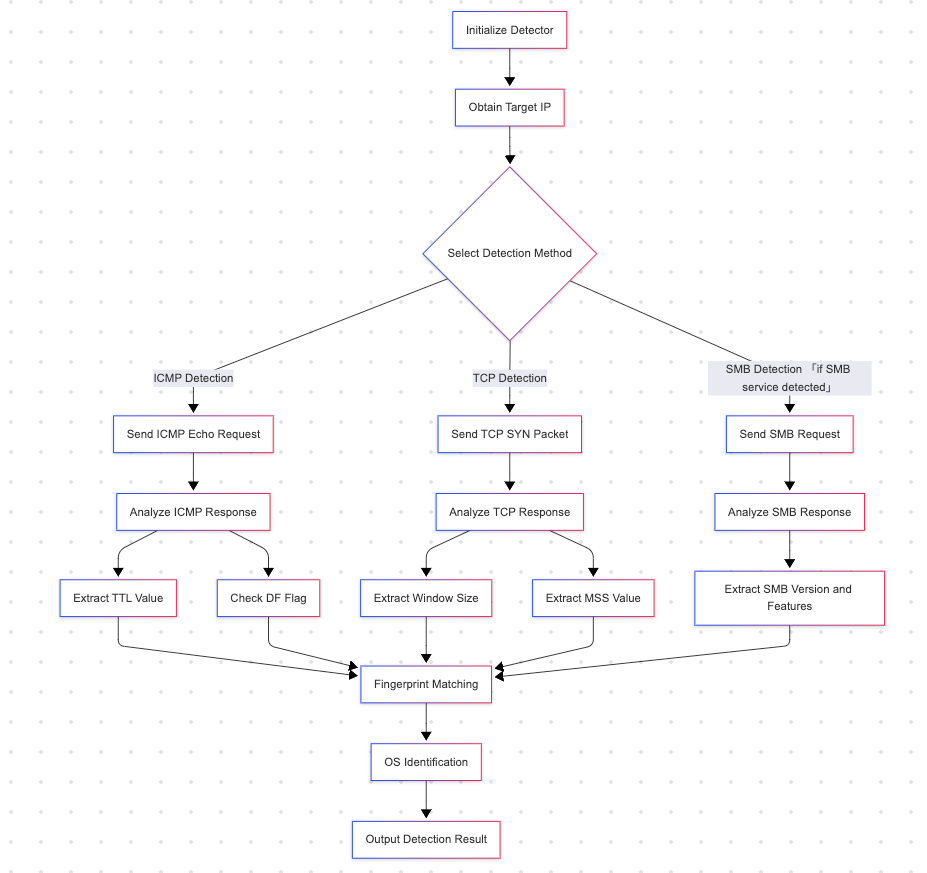

# OS Detector

## Description
This is an operating system detection tool based on TCP/IP stack fingerprinting technology, implemented in Go. The tool references the operating system detection principles of nmap and can identify the operating system type of the target host by analyzing the characteristics of network packets.

## Features

- Supports operating system detection via ICMP protocol (Ping)
- Supports operating system detection via TCP protocol
- Analyzes IP header characteristics (DF flag, TTL value)
- Analyzes TCP header characteristics (window size, MSS value)
- Supports identification of multiple operating systems (Windows, Linux, FreeBSD, etc.)
- Provides detailed detection process logs

## Usage
```bash
# Install dependencies
go mod tidy

# Compile
go build -o osdetector

# Run
./osdetector -t 192.168.1.1  # Specify target IP address
./osdetector -t 192.168.1.1 -v  # Show detailed information
```

## Implementation Principle
This tool is based on TCP/IP stack fingerprinting technology, identifying the operating system type of the target host by analyzing the characteristics of network packets. The main techniques used are:

1. FIN Probe - Sends a FIN packet to an open port and analyzes the response
2. IP Header Analysis - Analyzes the DF (Don't Fragment) flag and TTL (Time To Live) value
3. TCP Option Analysis - Analyzes TCP window size and MSS (Maximum Segment Size) value
4. ICMP Message Reference - Analyzes the characteristics of ICMP error messages
Different operating systems have subtle differences in their TCP/IP implementations. By analyzing these differences, the operating system type of the target host can be inferred.

### Detection Process




### Example of Running
```bash
osDetector % go run main.go -t 192.168.110.71
20:37:25 开始对目标: 192.168.110.71 进行操作系统识别
20:37:31 目标主机端口 135 开放，确认存活
20:37:31 开始使用TCP端口检测操作系统类型
20:37:37 检测到Windows特征端口 135 开放，可能是Windows系统
20:37:37 找到开放端口 135，TTL=128, DF=true, WinSize=8192, MSS=1440
20:37:37 找到开放端口 135，TTL=128, DF=true, WinSize=8192, MSS=1440
20:37:37 TCP检测结果为： Windows XP, Windows 7, Windows 10
20:37:37 检测到Windows特征端口 135，根据端口特征调整Windows系统权重
20:37:37 开始使用SMB端口检测操作系统类型
20:37:37 最终选择的操作系统: Windows 10 (权重: 6)

操作系统最终检测结果为： Windows 10
```

## References
- [NMAP](https://nmap.org/nmap-fingerprinting-article.txt)
- [RFC 793](https://datatracker.ietf.org/doc/html/rfc761)
- [RFC 9293](https://www.rfc-editor.org/info/rfc9293)
- [RFC 791](https://datatracker.ietf.org/doc/html/rfc791)
- [RFC 6691](https://www.rfc-editor.org/rfc/rfc6691.html)
- [RFC 6973](https://datatracker.ietf.org/doc/html/rfc6973)

## TODO LIST
- [ ] Support for Bunch of IPs
-  [ ] Support more Portocol Detection 